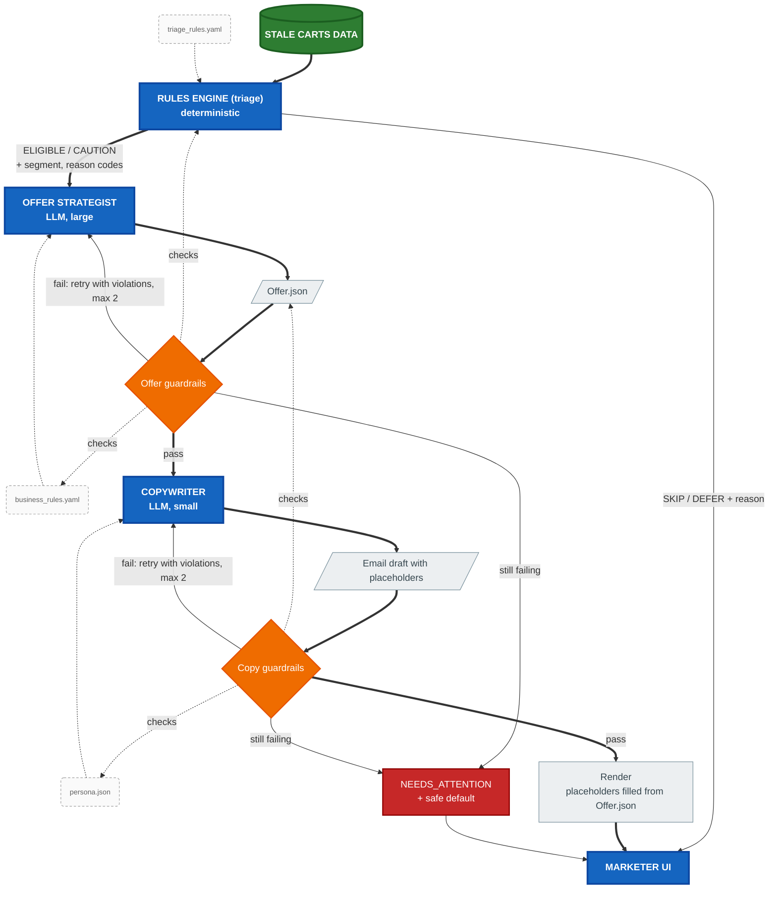
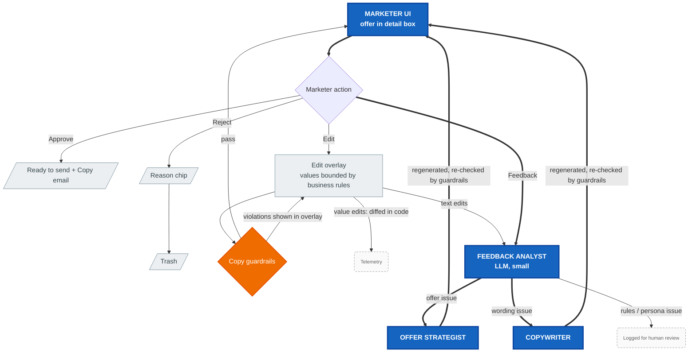

# Architecture

How the win-back pipeline works. The reasoning behind each choice is in [[decisions]]. The brief is in [[win_back_agent_instructions]].

## Pipeline



Legend: **green** = data source, **blue** = main stages, **orange** = deterministic guardrails, **grey** = intermediate outputs, **dashed** = configuration, **red** = escalation to the marketer. Thick arrows show the main path.

After the UI (see [[#Marketer UI and feedback loop]]):



A **run** processes every stale cart in the dataset at that moment, with per-cart LLM calls (no batching) at low concurrency. In the demo, a run starts from the "Start demo" button ([[decisions]] D-005).

Every step writes a telemetry event (see [[#Telemetry]]). Nothing is dropped silently: skipped, deferred and failed carts all appear in the UI with their reason.

## Rules Engine (triage)

Plain Python rules read from `config/triage_rules.yaml`. The output per cart is:

| Outcome | Meaning | LLM involved |
|---|---|---|
| `SKIP` | Never contact (hard rule, e.g. no email opt-in) | No |
| `DEFER` | Not yet (e.g. abandoned too recently); check again next run | No |
| `CAUTION` | Passes hard rules, but risk signals score above a threshold; the LLM is told to handle it carefully and the UI marks it | Yes |
| `ELIGIBLE` | Normal path | Yes |

The Rules Engine also assigns the **segment** (e.g. premium, loyal, first-timer, lapsed) and the **contact stage** (early / mid / late). The segment decides which offers the Strategist is allowed to choose. The contact stage decides the Copywriter's tone (`tone_by_contact_stage` in the persona).

Rule order: all `skip` rules, then `defer`, then caution scoring. Every result carries reason codes (`SKIP_*`, `DEFER_*`, `SIGNAL_*`, `SEGMENT_*`, `STAGE_*`). The Offer Strategist must cite these codes in `reason_codes_cited`.

Expected triage for the sample data, which is also the first golden set in [[#Evaluation]]:

| Cart | Outcome | Why |
|---|---|---|
| C-1001 | ELIGIBLE | Loyal fan (14 tickets), 3 h ago, early stage |
| C-1002 | ELIGIBLE | First-time buyer, 4 seats, 26 h ago; acquisition value |
| C-1003 | SKIP | No email opt-in |
| C-1004 | DEFER | 1 h ago, below the minimum contact delay; highest-value cart, so re-checked next run |
| C-1005 | CAUTION | 96 h ago, 1 lifetime ticket, last purchase 300 days ago |

## Configuration

Each value lives in exactly one file ([[decisions]] D-004).

| File | Owns | Read by |
|---|---|---|
| `config/triage_rules.yaml` | hard skips (consent, suspected reseller, dormant fan, outside window), minimum contact delay, contact-stage windows, segment definitions, caution scoring | Rules Engine |
| `config/business_rules.yaml` | per segment: allowed offer types, discount range (%), absolute $ cap. Offer catalogue (e.g. `discount_pct`, `free_parking`, `extra_seat`, `seat_upgrade`, `early_entry`, `reminder_only`) with **margin loss** and **illustrative** conversion rate for each option and level; these numbers are invented and the README says so | Offer Strategist, offer guardrails, UI edit form |
| `config/models.yaml` | model ID for each role | LLM client |

## Offer Strategist

- **Input:** static prefix (system prompt, offer catalogue) followed by one cart (cart facts, triage outcome, reason codes, segment, allowed options for that segment).
- **Output:** strict JSON schema (Pydantic model), for example:

```json
{
  "cart_id": "C-1001",
  "decision": "offer",
  "offers": [{ "type": "free_parking", "value": true }],
  "reason": "Loyal fan, abandoned 3 h ago; a low-cost perk is enough, a discount would waste margin.",
  "reason_codes_cited": ["SEGMENT_LOYAL", "STAGE_EARLY"],
  "confidence": 0.7
}
```

`decision` can be `offer`, `reminder_only` or `no_offer`.

## Guardrails

All checks are deterministic, and each one returns a list of violations.

**Offer guardrails:**
- offer type allowed for the segment
- value within the allowed range
- total cost within the $ cap
- `reason` present, and `reason_codes_cited` is a non-empty subset of the cart's triage codes, so the reason is grounded in facts
- warning (not a block) when the most expensive option was chosen although a cheaper one was allowed

**Copy guardrails:**
- placeholders ⊆ allowed set derived from the offer JSON
- required placeholders present
- no raw digits, `%` or `$` outside placeholders
- no `banned_terms` from the persona and no emojis
- no scarcity or deadline claims

**Failure policy:**
1. Re-prompt with the violations, up to 2 retries.
2. If it still fails, the cart becomes `NEEDS_ATTENTION` in the UI, with the violations, the last attempt and a deterministic safe default (reminder only). Values are never clamped silently.

## Copywriter and rendering

- **Input:** offer JSON, cart facts, contact stage, and the persona from `prompts/seattle_seawolves_persona.json` in the cached system prompt.
- **Output:** strict JSON with `subject` and `body`. Every value (discount, perk, seat count) is a `{{placeholder}}`, so the model cannot write a wrong number.
- **Rendering:** Jinja2 fills the placeholders from the offer JSON after the copy guardrails pass.

## Marketer UI and feedback loop

A minimal Next.js app built with shadcn/ui components; animations use `motion`.

1. **Landing:** a single "Start demo" button, which starts a real run.
2. **Workspace:**
   - A platform shell fades in. Its modules (e.g. Campaigns, Segments, Analytics) are visibly disabled, to show what v1 deliberately leaves out.
   - A side queue fills with offers one at a time as each cart finishes the pipeline, streamed from the API with server-sent events.
   - Queue items carry `CAUTION` and `NEEDS_ATTENTION` badges.
   - `SKIP` and `DEFER` carts sit in a collapsed "Not contacted" group, each with its reason.
3. **Detail box:** clicking a queue item opens a box in the center of the screen with the cart facts, the triage reason, the offer and its reason, and a preview of the rendered email. It has four buttons:

| Button | Effect |
|---|---|
| Approve | Status "Ready to send". The email is shown with a Copy button (there is no CRM) |
| Reject | One-click reason chips that map to `feedback_category` (Too generous → `offer_too_generous`, Wrong tone → `tone_off`, Shouldn't contact → `should_not_contact`, Other → `other`), then the item drops into a trash can |
| Edit | An overlay covers about 75% of the detail box. Values are form controls bounded by the business rules. The text is a plain-textarea template, with a live preview that shows values as highlighted chips. Saved text is re-checked by the copy guardrails |
| Feedback | A pop-up with a text box. On send, a spinner shows while the Feedback Analyst routes the feedback and the target agent regenerates. The new result (offer or email) replaces the old one, with the changes highlighted |

**Feedback Analyst output:** `feedback_category` (offer_too_generous, offer_too_weak, wrong_offer_type, tone_off, factual_error, off_brand, should_not_contact, other), `target_component` (triage, business_rules, offer_strategist, copywriter, persona), `severity`, `suggested_change`. Only `offer_strategist` and `copywriter` are routed automatically; the other targets are logged for a human to act on.

For edits to structured values, the diff is computed in code (e.g. 20% → 15% means `offer_too_generous`). Only text edits go to the Feedback Analyst.

## Models

All models run on Groq with strict JSON-schema outputs. Model IDs live in `config/models.yaml`.

| Role | Model | Why |
|---|---|---|
| Offer Strategist | `openai/gpt-oss-120b` | The judgement step; largest model |
| Copywriter | `openai/gpt-oss-20b` | Tightly constrained and fully checked by guardrails |
| Feedback Analyst | `openai/gpt-oss-20b` | Classifies into a fixed taxonomy |
| Baseline | `openai/gpt-oss-120b` | Same model as the Strategist, for a fair comparison |

The static prompt content always comes first so that provider-side prompt caching applies where available. The free tier has rate limits, so calls run with low concurrency and retry with backoff on HTTP 429.

## Telemetry

A single `events` table, written with SQLModel: Postgres on Supabase when deployed and SQLite locally, selected by `DATABASE_URL`. Columns: `run_id, cart_id, stage, status, reason_codes, payload_json, model, tokens_in, tokens_out, cached_tokens, latency_ms, attempt, created_at`.

Stages: `triage`, `offer`, `offer_guardrail`, `copy`, `copy_guardrail`, `render`, `ui_action`, `feedback`.

## Evaluation

- **Golden set (pytest):** the expected triage outcomes above, plus synthetic adversarial carts (e.g. opted-out high value, reseller pattern, first-timer with a huge cart). These cover the hard constraints: C-1003 is never contacted, no offer exceeds its caps, and no raw values appear in copy.
- **Looks right but is wrong:** a fluent reason that cites facts the cart doesn't have (e.g. "loyal fan" for first-timer C-1002). This is caught by the `reason_codes_cited` check; golden cases assert it.
- **Baseline run:** one plain LLM call over the same dataset (no Rules Engine, business rules or guardrails). Its offers are scored with the same guardrail checks, and the two runs are compared on violations, cost of the offers made, and carts wrongly contacted.
- **Online metrics:** guardrail pass rate, retry and `NEEDS_ATTENTION` rate, approve / edit / reject rate, edit magnitude, and rejections by `feedback_category`.

## Layout (planned)

```
config/                   triage_rules, business_rules, models
data/stale_carts.csv
prompts/                  persona + system prompts
src/winback/              triage, agents, guardrails, render, telemetry, api
tests/
web/                      Next.js marketer UI
```

## Stack

- **Python 3.13 with uv:** `groq`, `pydantic`, `pyyaml`, `jinja2`, `tenacity`, `fastapi`, `sqlmodel`, `psycopg`, `pytest`, `ruff`.
- **Web:** Next.js, shadcn/ui, `motion`.
- **Deploy:** Vercel (the UI, and FastAPI as a Python function) plus Supabase Postgres. The public demo spends the Groq free tier, so "Start demo" is rate-limited.
- **Not used:** rules-engine libraries or agent frameworks ([[decisions]] D-017).
